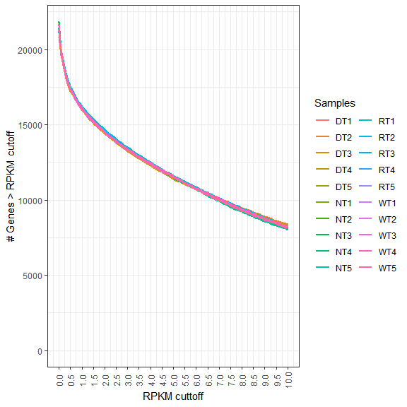
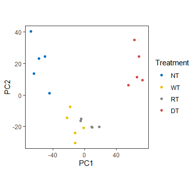
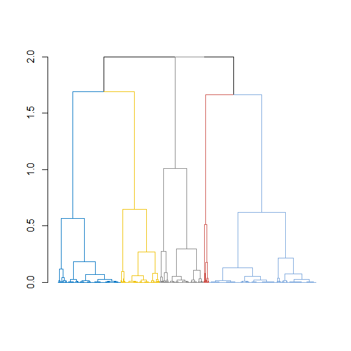
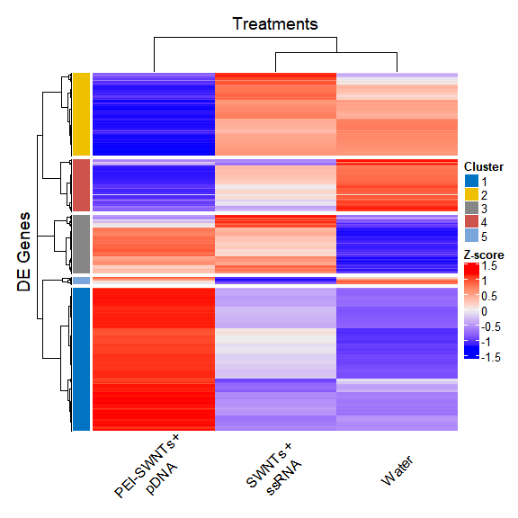
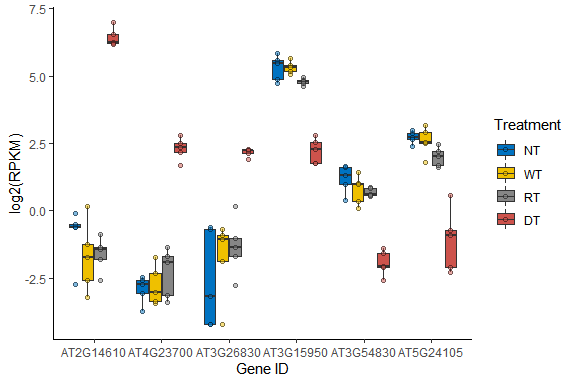
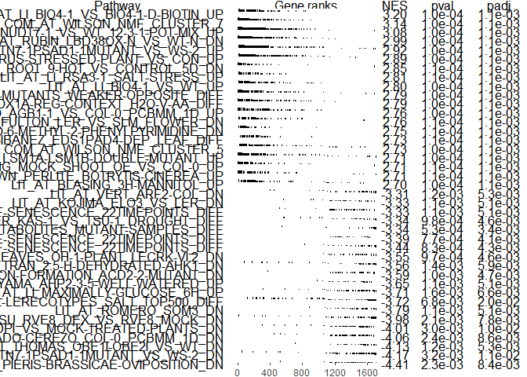

RNAseq analysis
================
Eduardo González-Grandío
June 2nd, 2020

Data preprocessing (done remotely in usegalaxy.org)

1- Trim low quality bases (Trimmomatic)

2- Align paired-end reads (HISAT2)

3- Remove reads that do not map, map to several regions or are unpaired
(Filter BAM)

4- Count reads per annotated gene (FeatureCounts): outputs
“Feature\_count.txt” and “feature\_length.tabular” files

5- Compare expression between samples (edgeR):

Load required libraries:

``` r
library(edgeR)
library(biomaRt)
library(data.table)
library(org.At.tair.db)
library(dendextend)
library(WebGestaltR)
library(ComplexHeatmap)
library(pals)
library(ggsci)
library(tidyverse)
library(splitstackshape)
library(stringr)
library(fgsea)
library(gridtext)
```

6- Calculate DGEList object (d) and calculate RPKM (outputs “RPKM.txt”
file):

``` r
library(edgeR)
input="./data/Feature_count.txt"
feature.length="./data/Feature_length.txt"

counts = read.delim(input, row.names = 1) #read output from FeatureCounts
head(counts)
```

    ##            NT1  NT2   NT3  NT4  NT5   WT1  WT2  WT3  WT4   WT5  DT1  DT2  DT3
    ## AT1G01010   48   51    97   24   55   178   81   74   57   122  376  336  293
    ## AT1G01020  204  230   172  180  227   147  125  122  132   188  101   90   76
    ## AT1G01030   91   89    59   79  115    87   85   50   42    58   28   46   34
    ## AT1G01040 2897 2954  2915 2113 2762  1942 1630 1263 1679  2171 1329 1202  977
    ## AT1G01050 1011 1030  1140 1018 1137   914  703  718  869  1270  867  913  607
    ## AT1G01060 8784 9078 10806 8453 9749 10315 6535 7330 8135 10937 5318 6376 4365
    ##            DT4  DT5  RT1  RT2  RT3  RT4  RT5
    ## AT1G01010  314  342  153   79   78   98   71
    ## AT1G01020  124  120  128  124  111   78  182
    ## AT1G01030   60   59   91   44   51   47   36
    ## AT1G01040 1484 1365 1246 1329 1132 1204 1809
    ## AT1G01050  837  868  583  646  626  596 1002
    ## AT1G01060 6398 6445 5707 6205 5307 4789 8054

``` r
GeneLength = (read.delim(feature.length, row.names = 1)) #read file with length of genes to calculate RPKM
#Make sure GeneIDs are in the same order as the counts file

snames = colnames(counts)
treatment = as.factor(substr(snames, 1, 2))
treatment = factor(treatment, levels=c("NT","WT","RT","DT"))

#Create Differential Gene Expression List Object (DGEList) object
d0 = DGEList(counts = counts, 
             genes = data.frame(Length=GeneLength),
             group = treatment)

d0 = calcNormFactors(d0) #Calculate normalization factors based on library size

RPKM = rpkm(d0) #Calculate reads per kilobase per million reads using normalization factors

RPKM_output = RPKM %>% 
  as.data.frame %>% 
  rownames_to_column("GeneID")
  
write.table(RPKM_output, file = paste0("./output/RPKM.txt"), row.names=F, sep="\t", quote=F)

d0 = d0[filterByExpr(d0), ,keep.lib.sizes=FALSE] #remove genes with low counts and recalculate library size

d0 = calcNormFactors(d0) #Re-calculate normalization factors after removing genes with low amount of reads
```

Select a cut-off to remove genes without or with low amount of reads
mapped:

``` r
#Use RPKM to define cutt-off value to remove noise of low expressed genes (see https://www.ncbi.nlm.nih.gov/pmc/articles/PMC6096346/)

#Convert RPKM to long format data.frame

RPKMdf = RPKM %>% as.data.frame %>%
  rownames_to_column("GeneID") %>%
  gather(!GeneID,key=treatment,value=RPKM) %>%
  separate(treatment,into=c("treatment","replicate"),sep=2) %>% mutate_if(is.character, as.factor) %>% 
  as_tibble 

#Calculate number of genes left in each sample after each cut-off value (defined by start, end and increment)
start = 0
end = 10
increment = 0.1

list_RPKM_cutoff = list()
count=0

for(i in seq(start,end,increment)){
  count = count+1
  list_RPKM_cutoff[[count]] = RPKMdf %>% group_by(treatment,replicate) %>% 
    summarize(!!as.character(i) := sum(RPKM>i))}

Merged_list = list_RPKM_cutoff %>% reduce(inner_join, by =c("treatment","replicate"))

Merged_list = Merged_list %>% gather(!c(treatment,replicate),key=threshold,value=Genes_above_threshold) %>%
  unite(treatment,replicate,col="sample",sep="")

Merged_list$threshold = as.numeric(Merged_list$threshold)

plot = ggplot(Merged_list, aes(x=threshold,y=Genes_above_threshold,color=sample))+
  geom_line(lwd = 1) + 
  theme_bw() + 
  theme(legend.position = "right")+
  theme(axis.text.x = element_text(angle = 90,vjust=0.5))+
  scale_x_continuous(name="RPKM cuttoff", breaks=seq(start,end,0.5))+
  scale_y_continuous(name="# Genes > RPKM cutoff", limits=c(0, max(Merged_list$Genes_above_threshold)))+
  labs(color = "Samples")+
  guides(colour=guide_legend(ncol=2))

plot
```



In this case, we chose as cut-off 1 RPKM

``` r
RPKM_cutoff = 1

drop = d0 %>% rpkm %>% rowMeans %>% `<`(RPKM_cutoff) %>% which #get index of genes below threshold

d = d0[-drop, ,keep.lib.sizes=FALSE] #More stringent criteria to remove genes with low read counts

d = calcNormFactors(d)
```

Generate PCA plot using filtered RPKM data:

``` r
RPKM = (rpkm(d,log = T))
RPKM_PCA = prcomp(t(RPKM))
RPKM_PCA_PLOT = RPKM_PCA$x[,1:2]

RPKM_PCA_PLOT = RPKM_PCA_PLOT %>% as.data.frame %>%
  rownames_to_column("SampleID") %>%
  separate(SampleID,into=c("treatment","replicate"), sep=2) %>% 
  mutate_if(is.character, as.factor) %>% 
  mutate(treatment = factor(treatment,levels = c("NT","WT","RT","DT"))) %>% 
  as_tibble

ggplot(data = RPKM_PCA_PLOT, aes(x = PC1, y = PC2, color = treatment)) + 
  geom_point() +
  labs(color = "Treatment") +
  scale_color_jco() +
  scale_fill_jco() +
  theme_test() +
  theme(aspect.ratio = 1)
```



``` r
filename = "./output/PCAplot.svg"
ggsave(filename, height = 3, width = 3)
```

7- To compare all the samples to control:

``` r
design = model.matrix(~treatment)

d = estimateDisp(d, design, robust=TRUE)

fit = glmQLFit(d, design, robust=TRUE)

#colnames(fit) to select which sample type to compare to the control (intercept)

qlf = glmQLFTest(fit, coef=2:4) #compares all the samples to the control (ANOVA-like test)

AllvsCtrl = topTags(qlf, n = Inf) #unfiltered data

AllvsCtrl_output = rownames_to_column(AllvsCtrl$table,"Gene")

write.table(AllvsCtrl_output, file = paste0("./output/AllvsCtrl.txt"), row.names=F, sep="\t", quote=F)

#Filter by FDR < 0.05 and at least one of the comparisons with logFC greater than 1

FCts = log2(2) #set log2(Fold change) threshold
FDRts = 0.05 #set FDR threshold

Filtered_byFDR = topTags(qlf, n = Inf, p.value = FDRts)

tmp = AllvsCtrl$table %>% dplyr::select(c(logFC.treatmentWT,logFC.treatmentRT,logFC.treatmentDT)) %>%
  as.matrix %>% abs %>% rowMax %>% `>`(FCts) %>% which #Select only genes with abs(logFC)>FCts

Filtered_AllvsCtrl = Filtered_byFDR[tmp,]

head(Filtered_AllvsCtrl$table)
```

    ##           Length logFC.treatmentWT logFC.treatmentRT logFC.treatmentDT   logCPM
    ## AT1G21240   2422        2.96674871         3.7371969          8.059693 4.035865
    ## AT3G15536    495        1.33337783         2.7300966          5.819152 2.281665
    ## AT1G09932   1443        1.88438553         3.3242943          5.707507 3.360015
    ## AT4G00700   3611        1.13613808         2.6300577          6.300830 4.405263
    ## AT2G38860   2127       -0.07110813        -0.1787093          3.025977 5.621593
    ## AT3G13950   1206        1.78454256         2.4608951          6.459634 2.503970
    ##                  F       PValue          FDR
    ## AT1G21240 576.7402 3.437391e-19 5.570980e-15
    ## AT3G15536 473.0633 1.508623e-18 1.222513e-14
    ## AT1G09932 385.8037 1.093145e-17 5.905536e-14
    ## AT4G00700 396.3470 2.928449e-17 9.717734e-14
    ## AT2G38860 360.9900 2.998005e-17 9.717734e-14
    ## AT3G13950 338.3309 3.899023e-17 1.053191e-13

``` r
Filtered_AllvsCtrl_output = na.omit(rownames_to_column(Filtered_AllvsCtrl$table,"Gene"))

write.table(Filtered_AllvsCtrl_output, file = paste0("./output/Filtered_AllvsCtrl.txt"), row.names=F, sep="\t", quote=F)
```

8- Heatmap (using logFC):

``` r
### Select genes that change specifically in DT (manually)
data = Filtered_AllvsCtrl$table
data = data[complete.cases(data),]

onlyDTup = data[which((data$logFC.treatmentWT < 1) &
             (data$logFC.treatmentRT < 1) &
             (data$logFC.treatmentDT > 1)),]

onlyDTdn = data[which((data$logFC.treatmentWT > -1) &
             (data$logFC.treatmentRT > -1) &
             (data$logFC.treatmentDT < -1)),]

onlyDT = rbind(onlyDTup,onlyDTdn)

onlyDT = onlyDT[order(onlyDT$logFC.treatmentDT),]

onlyDT = onlyDT[complete.cases(onlyDT),]

### Get genes with significant change in at least one condition vs control:
data = Filtered_AllvsCtrl$table
data = data[complete.cases(data),]

#### BUILD MATRIX FOR HEATMAP
filtered_data = as.matrix(data[,2:4])
filtered_data = filtered_data[order(row.names(filtered_data)), ]
colnames(filtered_data) = c("WT","RT","DT")

#Z-score by rows
x = filtered_data
x = as.matrix(x)
nsamples = ncol(x)
M = rowMeans(x, na.rm = TRUE)
DF = nsamples - 1L
IsNA = is.na(x)
if (any(IsNA)) {
  mode(IsNA) = "integer"
  DF = DF - rowSums(IsNA)
  DF[DF == 0L] = 1L}
x = x - M
V = rowSums(x^2L, na.rm = TRUE)/DF
x = x/sqrt(V + 0.01)

###Set number of clusters (use heatmap first to decide optimal number)
clusters = 5

#Generate dendrogram to make block annotation:
dend = as.dendrogram(hclust(as.dist(1- cor(t(x))),"complete"), hang=-1)

dend %>% dendextend::set("branches_k_color", k = clusters, value = pal_jco()(clusters)) %>% plot(leaflab="none")
```



``` r
#Create annotation block for heatmap
cl_num = cutree(dend, k = clusters)
cl_col = pal_jco()(clusters)
names(cl_col) = unique(cl_num)
cl_col = list(cl_num=cl_col)

row_ha = rowAnnotation(cl_num = cl_num,
                       col = cl_col,
                       annotation_legend_param = list(title = "Cluster"),
                       show_annotation_name = F)

col_lab = gt_render(c("Water","SWNTs +<br> ssRNA","PEI-SWNTs +<br> pDNA"))

Heatmap(x,
        clustering_distance_columns = "euclidean",
        clustering_method_columns = "complete",
        clustering_distance_rows = "pearson",
        clustering_method_rows = "complete",
        row_split = clusters,
        left_annotation = row_ha,
        show_row_names = F,
        heatmap_legend_param = list(title = "Z-score"),
        column_title = "Treatments",
        row_title = "DE Genes",
        use_raster = F,
        column_labels = col_lab,
        column_names_rot = 45,
        column_names_centered = TRUE,
        column_names_max_height = unit(6, "cm"))
```



``` r
###Select interesting clusters based on the heatmap
Cluster_UPGENES = 1
Cluster_DNGENES = 2

gnames_UPGENES = names(cl_num[which(cl_num == Cluster_UPGENES)])
gnames_DNGENES = names(cl_num[which(cl_num == Cluster_DNGENES)])

gnames_for_GSEA = c(gnames_UPGENES,gnames_DNGENES)

DE_GSEA = Filtered_AllvsCtrl$table[gnames_for_GSEA,]
```

9- Marker genes from clusters:

``` r
### RPKM data frame in long format:

RPKM = (rpkm(d,log = T))

RPKMdf = RPKM %>% as.data.frame %>%
  rownames_to_column("GeneID") %>%
  gather(!GeneID,key=treatment,value=RPKM) %>%
  separate(treatment,into=c("treatment","replicate"),sep=2) %>% 
  mutate_if(is.character, as.factor) %>% 
  as_tibble 

gnames_UPGENES = names(cl_num[which(cl_num == Cluster_UPGENES)])
gnames_DNGENES = names(cl_num[which(cl_num == Cluster_DNGENES)])

#Number of up and down regulated genes to be plotted:
ngenes = 3

#Get data of up-regulated genes:
gnames = gnames_UPGENES

onlyDT_data = onlyDT[which(rownames(onlyDT) %in% gnames),]

onlyDT_data = onlyDT_data[order(-(abs(onlyDT_data$logFC.treatmentDT))),]

onlyDT_fdata = RPKMdf %>% filter(GeneID %in% c(head(rownames(onlyDT_data),ngenes))) %>%
  mutate(treatment = factor(treatment, 
                            levels = c("NT","WT","RT","DT")))

oDTf_up = onlyDT_fdata

#Get data of down-regulated genes:
gnames = gnames_DNGENES

onlyDT_data = onlyDT[which(rownames(onlyDT) %in% gnames),]

onlyDT_data = onlyDT_data[order(-(abs(onlyDT_data$logFC.treatmentDT))),]

onlyDT_fdata = RPKMdf %>% filter(GeneID %in% c(head(rownames(onlyDT_data),ngenes))) %>%
  mutate(treatment = factor(treatment, 
                            levels = c("NT","WT","RT","DT")))

oDTf_dn = onlyDT_fdata

# Merge data from up and down genes:

oDTf = bind_rows(oDTf_up, oDTf_dn) %>% droplevels()

#### Reorder genes (factor) by ratio DT/NT (as they are in log2, logDT-logNT):

oDTf_mDT = oDTf %>% group_by(GeneID,treatment) %>%
  filter(treatment == "DT" | treatment == "NT") %>% 
  summarise(mean_RPKM = mean(RPKM)) %>%
  spread(treatment, mean_RPKM) %>% 
  summarise(ratioDT = DT-NT) %>% 
  arrange(-ratioDT) %>% 
  mutate(GeneID = fct_reorder(GeneID, -ratioDT)) %>% 
  ungroup()

oDTf = oDTf %>% mutate(GeneID = factor(GeneID, levels = levels(oDTf_mDT$GeneID)))

### Plot data:
ggplot(data = oDTf, aes(x = GeneID, y = RPKM, fill = treatment)) + 
  geom_boxplot(outlier.shape = NA) +
  geom_jitter(position=position_dodge(0.75),
              shape=21,
              alpha=0.5,
              aes(fill = treatment),
              color="black")+
  scale_y_continuous() +
  xlab("Gene ID") + 
  ylab("log2(RPKM)") +
  labs(fill = "Treatment") +
  scale_color_jco() +
  scale_fill_jco() +
  theme_classic()
```



``` r
filename = paste0("./output/boxplot_",ngenes,"genes.svg")
ggsave(filename)
```

    ## Saving 6 x 4 in image

10- GSEA analysis:

``` r
###Prepare GMT file and experiment descriptions:
AraPath_GMT = gmtPathways("./output/AraPath.gmt")

AraPath_longdesc = fread("./data/GSEA gmt format-all.gmt", fill=T, na.strings="") %>% dplyr::select(c(1,2))

colnames(AraPath_longdesc) = c("short_name","long_desc")

GMTs = c(AraPath_GMT)
GMT_longdesc = rbind(AraPath_longdesc)

###GSEA
genelist = DE_GSEA #Select genes that are specifically Up or Downregulated in PEI-SWNT samples

ranked_genes = setNames(genelist$logFC.treatmentDT,rownames(genelist))

ranked_genes = ranked_genes[order(ranked_genes)]

fgseaRes = fgsea(pathways = GMTs, 
                 stats    = ranked_genes,
                 minSize  = 10,
                 maxSize  = 500,
                 nperm = 10000,
                 nproc = 7)

topPathwaysDown = fgseaRes[padj < 0.05][head(order(NES), n=20), pathway]
topPathwaysUp = fgseaRes[padj < 0.05][head(order(-NES), n=20), pathway]

topPathways = c(topPathwaysUp, rev(topPathwaysDown))

test_cluster = plotGseaTable(GMTs[topPathways], ranked_genes, fgseaRes, 
              gseaParam=0.5) 
```

<!-- -->

``` r
topPathwaysDesc = GMT_longdesc %>% filter(short_name %in% topPathways)
View(topPathwaysDesc)

fwrite(topPathwaysDesc, file = "./output/toppathways.txt",sep="\t")


topPathwaysDescUp = GMT_longdesc %>% filter(short_name %in% topPathwaysUp)
fwrite(topPathwaysDescUp, file = "./output/toppathwaysUp.txt",sep="\t")

topPathwaysDescDn = GMT_longdesc %>% filter(short_name %in% topPathwaysDown)
fwrite(topPathwaysDescDn, file = "./output/toppathwaysDn.txt",sep="\t")
```

``` r
### WIP, individual GSEA plots
# 
# GSEA_result_up = fgseaRes %>% filter(padj < 0.05) %>% arrange(desc(NES))
# 
# GSEA_result_down = fgseaRes %>% filter(padj < 0.05) %>% arrange(NES)
# 
# GSEA_result = GSEA_result_down
# GSEA_result = GSEA_result_up
# 
# ###Single plot for GSEA:
# GSEA_for_plot = GSEA_result[1,1]
# 
# plotEnrichment(GMTs[[GSEA_for_plot]], ranked_genes) +
#   labs(title=names(GMTs[GSEA_for_plot]))
# 
# #Barcodeplot:
# idx = ids2indices(AraPath_GMT,id=rownames(genelist))
# test = genelist$logFC.treatmentDT
# idx[[GSEA_for_plot]]
# 
# barcodeplot(test,
#             index=idx[[GSEA_for_plot]],
#             main=GSEA_for_plot)
# 
# #######facetwrap multiple gsea plots
```
